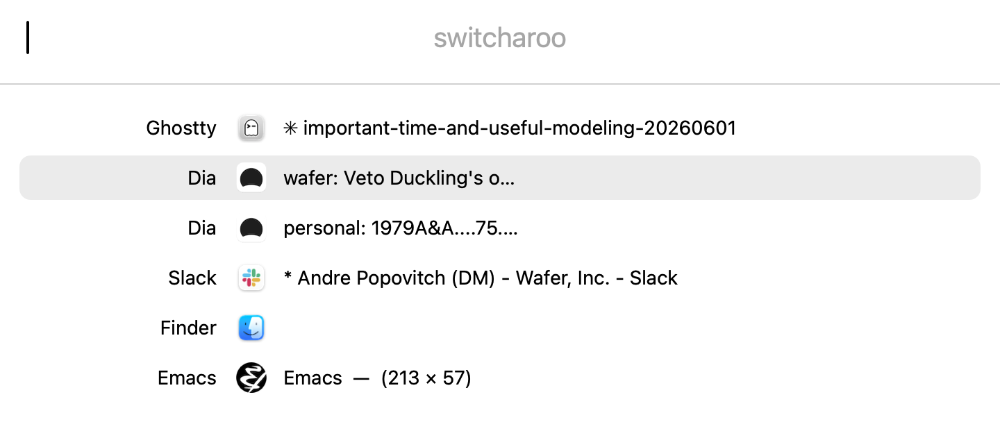

# switcharoo

A tiny macOS window switcher — Cmd+Tab, but it knows about windows.

<picture>
  <source media="(prefers-color-scheme: dark)" srcset="assets/switcharoo-dark.png">
  
</picture>

Single Swift file, no dependencies, no Xcode project. Window lists are
MRU-ordered; titles update live while the panel is open.

## keys

| key | action |
| --- | --- |
| `Cmd+Tab` / `Cmd+Shift+Tab` | quick mode — release Cmd to switch |
| `Opt+Tab` / `Opt+Shift+Tab` | search mode — type to filter |
| `Up`/`Down` · `Ctrl+K`/`Ctrl+J` · `Tab` | move selection |
| `Enter` / `Esc` | switch / cancel |
| `Cmd+M` · `Cmd+H` · `Cmd+Q` · `Cmd+Opt+Q` | minimize · hide · quit · force-quit the highlighted app |

URL scheme for Raycast/Alfred/scripts: `switcharoo://show`, `switcharoo://quick`,
`switcharoo://snap` (renders the panel to `/tmp/switcharoo-ui.png`),
`switcharoo://login-on` / `switcharoo://login-off` (launch at login).

## build

```sh
./setup-dev-cert.sh   # once — stable self-signed identity, so the
                      # Accessibility grant survives rebuilds
./build.sh            # compile, sign, install to /Applications, relaunch
```

Requires macOS 14+ and the Accessibility permission (prompted on first
launch). Cmd+Tab interception starts as soon as the grant lands.

MIT.
